# CSE167-Final-Project Ray Tracing (Yen-Yun Wu & Niya Shao)

Original code from cse167 @ ucsd HW3 (2022 Fall)

## Introduction
Ray Tracing is an image rendering technique that provides photorealism. In comparison to Rasterization, it also renders higher quality of effects such as shadows, reflections, transparency, inter-reflections, and realistic materials.

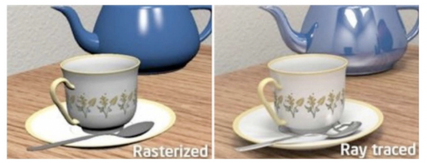

----

## Underlying Secrets

### Mechanism of **seeing** an object

When the light hits an object, it will scattered and reflected to different directions. If any of the scattered or reflected light rays reaches a receiver, aka a camera or an eye, the receiver will **see** the object. This is the physics of how the 3D world is seen as a 2D image by the eye or the camera. Ray tracing algorithm leverages this physics rule to render an image based on a 3D scene. But instead of simulating light from light source to the eye, it traces a light ray from the eye to the object.

### Ray Through Pixel
First, ray tracer simulates a light path from the eye to an pixel in the image plane. To do so, it needs the *location of the pixel in the image plane* ($\alpha$, $\beta$), *field of view y-axis* (fovy), *aspect ratio* (a) and *center of the camera*.

If everything is in the camera coordinate, then the *center of the camera* is easily defined as a position vector (0,0,0). *fovy* is given as a property of the camera. *a* is $\frac{image \space width}{image \space height}$ which is also given by the camera.

Now what left is $\alpha$, $\beta$. This depends on which pixel we want the ray to go through. Let such pixel be at *(i, j)* location on the image plane. The center of the pixel in normalized device coordinate is then defined as: 

$\alpha$, $\beta$ = $2 \ast \frac{i + 0.5}{image \space width} - 1, 1 - 2 \ast \frac{j + 0.5}{image \space height}$

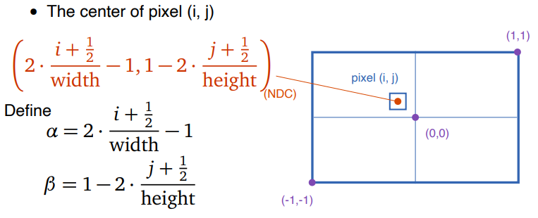

Note that here the ray assume to go through the center of the pixel. An alternative way is to randomly choose a $i_r = [i, i+1)$ and a $j_r = [j, j+1)$ and replace $i$ and $j$ in the above formula with $i_r$ and $j_r$. If we repeat this random process multiple times, the pixel color will be the average of the resulting colors. In the demonstration, we mostly adopted this method. But we also provide an example of "ray through center of the pixel" method.

In the camera coordinate, a ray from camera to $\alpha$, $\beta$ will have source = (0,0,0). Assume the distance between camera and the image plane is 1, the intrinsic property of the camera determines the image plane's height to be $2 \ast tan(\frac{fovy}{2})$ and width to be $2 \ast a \ast tan(\frac{fovy}{2})$. Therefore, the ray pass the position $(\alpha \ast a \ast tan(\frac{fovy}{2}), \beta \ast tan(\frac{fovy}{2}), -1)$ (z-axis point toward the back of the camera), which indicates that the direction of the ray is the vector $normalize(\alpha \ast a \ast tan(\frac{fovy}{2}), \beta \ast tan(\frac{fovy}{2}), -1)$.

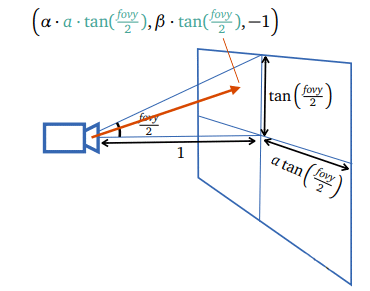

Now we defined the ray going from the center of the camera to a specific pixel in the image plane.

### Intersection
Extending this light ray path, it might **hit** multiple objects in the scene. Among those hits, the **nearest** hit is the one which might scatter light from light source.

To find such a hit, it is necessary to define what "object" looks like in the ray tracing algorithm. Each model included in the scene could be approximated by a triangle mesh. Therefore, after transforming the location and the normal of every triangles from the model coordinate to the camera coordinate, we obtained a **triangle soup** as an aggregation of triangles from every models.

To find the **hit** of a particular light ray with the scene, we only need to iterate through every triangle in the **triangle soup** to check if the ray intersects with it. Among the hitted triangles, the one nearest to the camera is what the pixel might receive light from.

To find an intersection between a ray and a triangle, we need *three vertices of the triangle (p1, p2, p3)*, *three normals of each vertices of the triangle (n1, n2, n3)*, *ray source (p0)*, and *ray direction (d)*. 

In barycentric coordinate, the *location of intersecting point (q)* is represented as an interpolation between three triangle vertices $q = \lambda_1 p_1 + \lambda_2 p_2 + \lambda_3 p_3$. Similary, the *normal of the intersecting point (n)* is represented as an interpolation between three triangle normals $n = normalize(\lambda_1 n_1 + \lambda_2 n_2 + \lambda_3 n_3)$.

To solve for $\lambda_1, \lambda_2, \lambda_3$, the following formula is used:

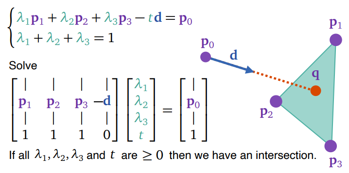

The $t$ in the formula indicates the distance between the hit and the camera center (source of ray under the camera coordinate).

Now we have found which is the nearest triangle, aka part of the object, hit by the light.

### Triangle/Object material properties

It is good to keep in mind that color is a combination of light properties and material properties. To define how a material surface reflects or scatters light, two major terms are used: 

- Diffuse: In an ideal diffuse surface, light ray is scattered equally in all directions. It is independent of view direction. This property is significant on non-shiny materials such as wood.
- Specular: In an ideal specular surface, the surface is prefectly smooth such that incoming light is bounced in a single direction, following the law that the angle of incidence equals to the angle of reflection. An example of specular light dominated material is a mirror.

### Diffuse Reflection

In this implementation of ray tracer, diffuse reflection is modeled as the diffuse intensity in *Phong Shading Model*. 

$R_{diffuse} = C_{diffuse} \ast L \ast max(n \cdot l, 0)$

Where $L$ is light intensity, $n$ is the surface normal (of triangle), $l$ is the light direction, and $R_{diffuse}$ is the reflected diffuse color seen by the viewer. Since the diffuse light is independent of view direction, $R_{diffuse}$ is independent of the center of the camera.

Specular reflection in the ray tracer will be explained in the later section.

### Shadow

Upon this point, the ray tracer knows which object the pixel might seen. However, this nearest object could be in shadow casted by other objects. Therefore, the second ray is shoot from the location of the hit to all the light sources. The source of the second ray source is the *hit location (q)*, the direction of the second ray is defined as $normalize(l_i - q)$ where $l_i$ is ith light's source location.

If the second ray hits an object, aka an object impeding the light from the light source, then the nearest object is in shadow. Thus, this light source will not be taken account into the pixel's color. In this case, the *visibility* is recorded as 0.

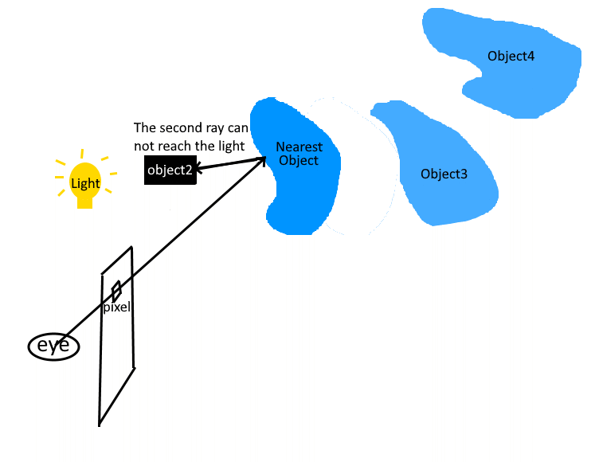

On the opposite, if the second ray successfully reaches the light, then the properties of materials and lights can be used to calculate the pixel's color. In this case, the *visibility* is recorded as 1.

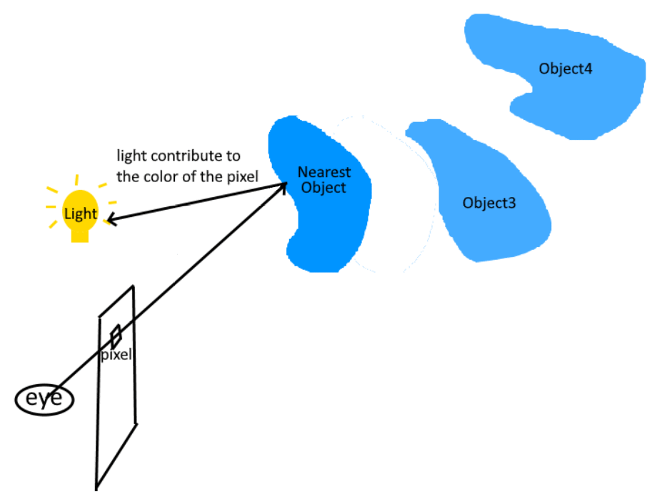

### Specular Reflection: Recursive Mirror Reflection

Beside direct light sources, the light indirectly reflected from other objects could also reach the nearest object, which is then reflected again and reach the pixel and the eye.

Imagine a mirror is stand in front of the eye and the image plane. The light from mirror could be from other object in the scene. This is how the viewer observe other objects from a mirror's surface. This mirror-like behavior of material is recorded as **specular** properties.

Therefore, besides the second ray to light source, another ray called **reflective ray** is shoot from the hit location such that it follows the reflective angle with respect to the surface normal. The color seen by this reflective ray, which is the color of the reflective object, is regarded as a light source used for calculating specular reflection of the nearest object.

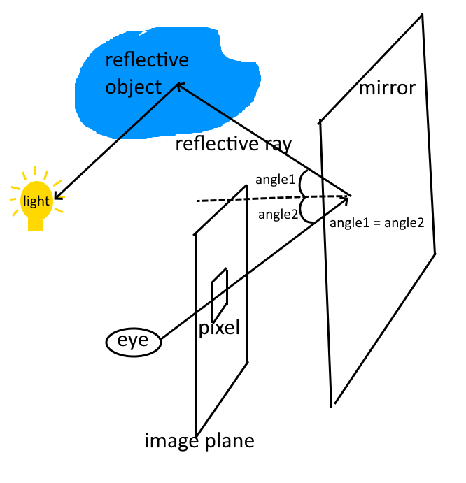

Since the reflective ray is shoot from the hit location, the source of the reflective ray is the *hit location (p)*. According to the law of incidence and reflectance angle, the *mirror reflection direction (r)* is defined as: $r = 2(n \cdot v) n - v$ where $n$ is the surface normal of the triangle and $v$ is the incoming ray (the ray through pixel) direction.

The specular reflection is calculated as $C_{specular} L_{(p,r)}$, where $L_{(p,r)}$ is the color seen by ray (p, r).

As seen in the formula, the term $L_{(p,r)}$ is naturally a recursive term. The above image only tells one reflection. In case of multiple reflections:

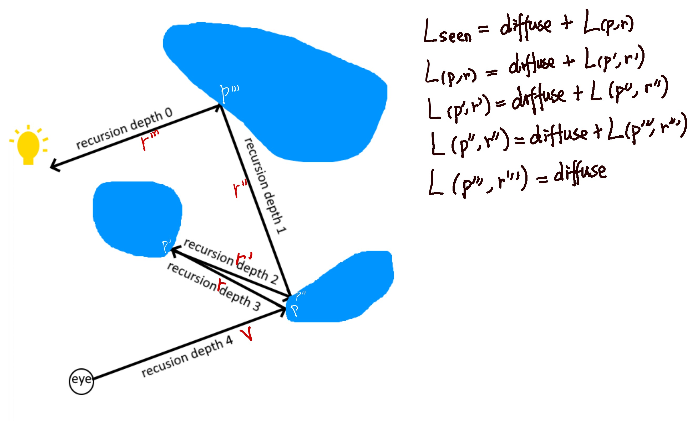

### Overall Shading Model

The overall shading model combines both diffuse and recursive specular reflections. It is modeled as:

$L_{seen} = (\sum_{i \in lights} C_{diffuse} * L_{light source_i} * max(n \cdot l_i, 0) * visibility_i) + C_{specular}*L_{(p,r)}$

---

## Implementation
Before the actual implementation of Ray Tracing, it is required to create serveral classes:
- `Image`: Contains the arrays of pixels where the color computed by ray tracer is stored. Also contains a frame buffer object and a texture buffer object which are used to draw the image on the screen using `Image::draw()` provided in the writeup. Its width and height is customizable.
- `Triangle`: Contains 3 point coordinates, 3 normal vectors, and a pointer to material.
- `RTGeometry`: Contains a list of triangles with their coordinates under the model coordinate system.
- `RTObj` and `RTCube`: Instead of filling in the vertex/index buffer data, the `init()` function of each model will fill in the list of triangles.
- `RTScene`:  Instead of drawing a model during DFS, it builds a triangle soup consisting of all triangles from all models within the scene. Specifically, it traverses over the scene graph, applies the proper model matrix and view matrix to transform the triangles to the camera coordinate system, and assigns the proper material for each triangle.
- `Ray`: Contains the base point and the direction of a ray.
- `Intersection`: Contains the position of an intersection, the surface normal, the direction to the incoming ray, the pointer to the geometric primitive (and matetial information), and the distance to the source of ray.

And also several helper functions:
- `RayThruPixel`: Calculates a ray under the camera coordinate system given the camera, a position (i, j), and the width/height of the image. (According to p.25-26 of RayTracing lecture slides)
- `Intersect` on Triangle: Returns an intersection object given an incoming ray and an intersecting triangle. At a high level, it finds the barycentric coordinate ($\lambda$) to interpolate the position of intersection and corresponding surface normal, and computes the distance between the ray source and the intersection. An intersection exsits if and only if the $\lambda$ and the distance are greater or equal to zero. Otherwise, the returned intersection object will have a distance of infinity (defined as $2^{10}$ in this project).
- `Intersect` on Scene: Returns an intersection object given an incoming ray and the scene. Specifically, it traverses the triangle soup of the scene and finds the closest intersection to the ray. Similar as the `Intersect` on triangle, it returns an intersection object with its distance infinity representing the given ray does not hit anything in the scene. 
- `FindColor`: Returns the computed color of the given intersection. The code applies the algorithm provided in Ray Tracing lecture slides p.71. It leverages both recursive shading model and mirror reflection. If recursion depth is 0, the color will be computed using the old-school diffuse model. Otherwise, it will compute either the recusive specular or diffuse shading.

Finally, `RayTrace` function is implemented. At a high level, for each pixel in the image, it samples multiple times to compute the ray through that pixel, the intersection of that ray, and the corresponding color seen given that intersection. Then, the final color is the average of those sample colors. Since the rendering of the texture buffer begins from the bottom left, resulting in an upside down image, we recomputes a correct coordinate to get a image in a proper direction.

In `main.cpp`, `display` function is changed such that it initializes the scene, computes the triangle soup, performs ray tracing, and render the image. 

Note: Our implementation does not accommodate the use of keyboard for real-time rendering. Please refer to the first rendered image in the window as the final result of the ray tracing.

## Demonstration of Results

Before viewing the actual results of ray tracing, let's see the image produced through rasterization:

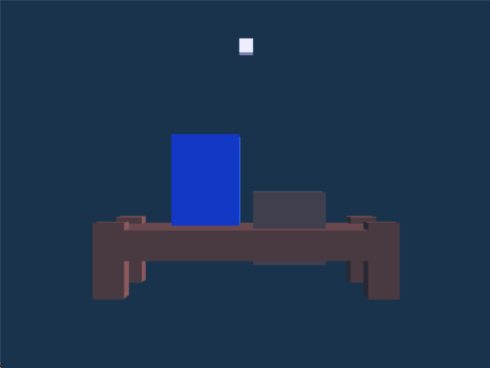

Emmm...It looks really boring, but it still has a certain level of shading. In fact, the left rectangular object has a ceramic material and the right is silver. Now let's get into ray tracing.

The quality of reflection, smoothness, and resolution of a rendered image depends on the sample size and the recusion depth. For this project, the window size (i.e. image size) is 500 width x 375 height. Our scene includes a small table with two rectangular objects on it. The only lighting invovled is the "sun" which has location (3.0f, 2.0f, 1.0f, 0.0f) at distance equal to infinity. The following images are the results with different sample sizes and recursion depths:

1. Sample Size = 3 & Recursion Depth = 1

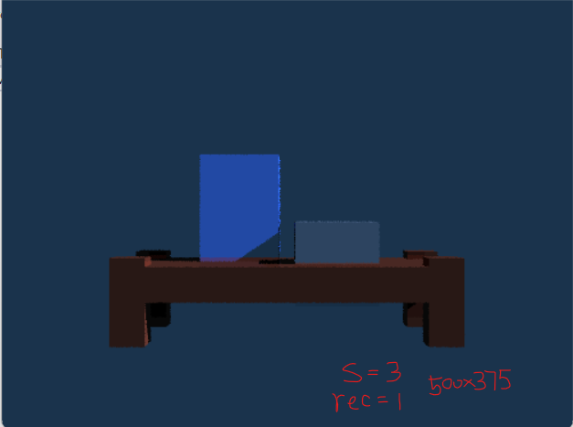

2. Sample Size = 3 & Recursion Depth = 3

3. Sample Size = 3 & Recursion Depth = 6

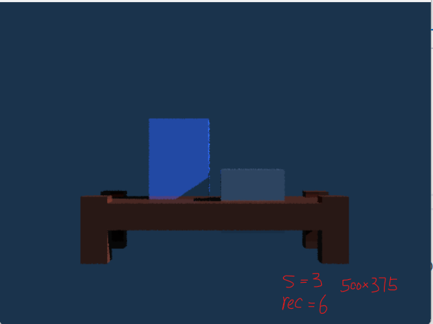

From the above three images with the same sample number = 3 but different recursion depths, the effect of mirror reflection is obvious when looking at the pixels at the bottom of each rectangular objects. Those pixels have a brighter color in the image with recursion depth = 3 in comparison to the image with recursion depth = 1.

4. Sample Size = 10 & Recursion Depth = 1

5. Sample Size = 10 & Recursion Depth = 6

6. Sample Size = 30 & Recursion Depth = 1

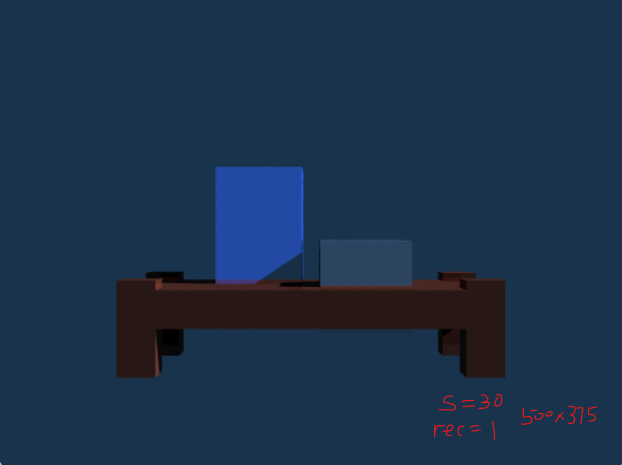

7. Sample Size = 30 & Recursion Depth = 3

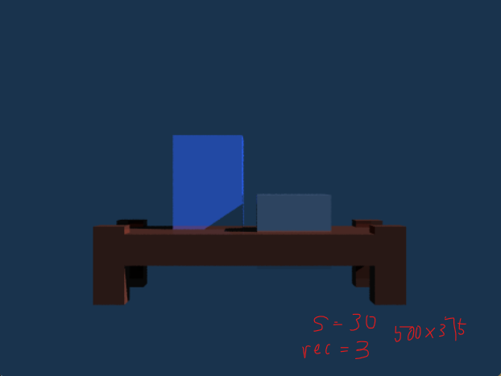

On the other hand, as the sample size increases, the smoothness of the objects in the scene has improved as there are less and less ragged pixels at their edges.

8. "Ray through center of the pixel" Sampling & Recursion Depth = 3

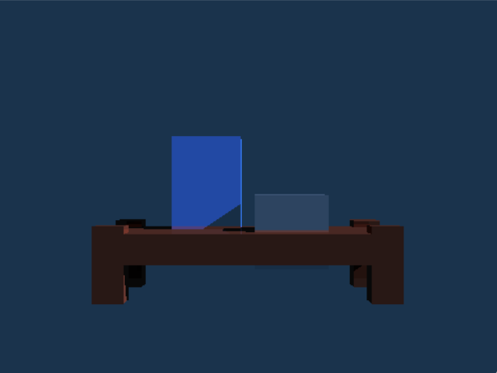

This is a demonstration of the alternative ray through pixel method described in the Underlying Secrets - Ray Through Pixel section.

The above images are good for demonstrating the effect of shading. For the mirror reflection, we built another scene:

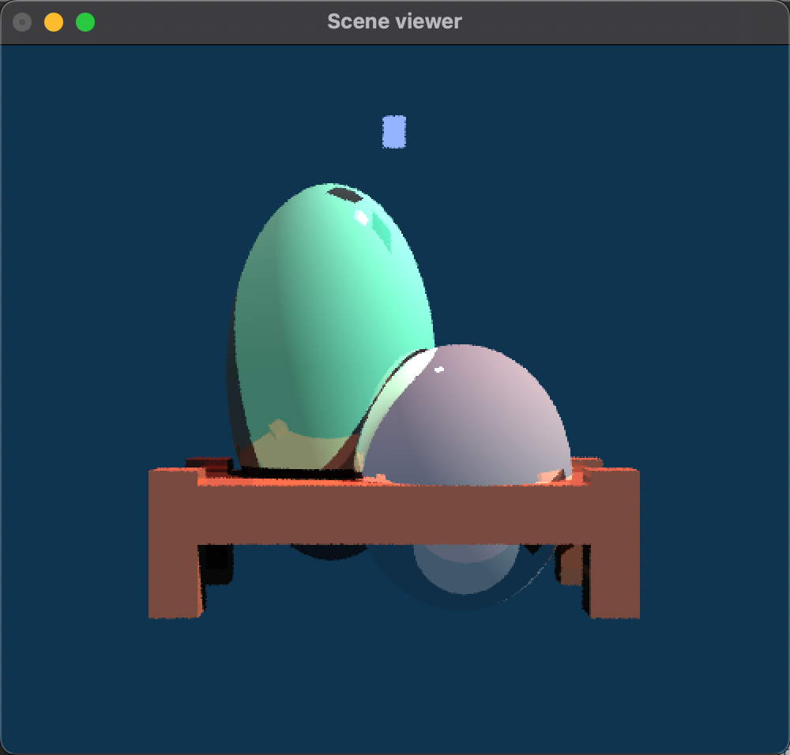

As there are much more triangles for spheres in comparison to cubes, we did not construct the scene with a large sample size since it would take a long time rendering. The left sphere (or egg) has a turquoise material and the right one is silver. As you can see, the mirror reflection of the table is clearly shown on the left sphere and the bottom of the right sphere.

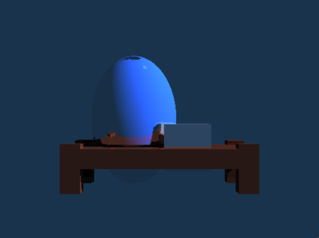

We also made a image with both sphere and cube to compare their reflective properties. The left sphere has a ceramic material and the right cube has a silver material. In the image, you can see the cube's shadow and reflection and the table corner's reflection casting on the sphere. Whereas the sphere's reflection casting on the cube is hiden behind the cube. The cubic shadow on the top of the sphere is because of the bulb. But because bulb has diffuse color as (0.0f, 0.0f, 0.0f) and our model do not include ambient and emision, the bulb does not show up in the image.

## This is the end of our project writeup! Thanks for taking time reading it :)

## Reference
1. Ray Tracing Writeup
2. Piazza
3. Ray Tracing Lecture slides
