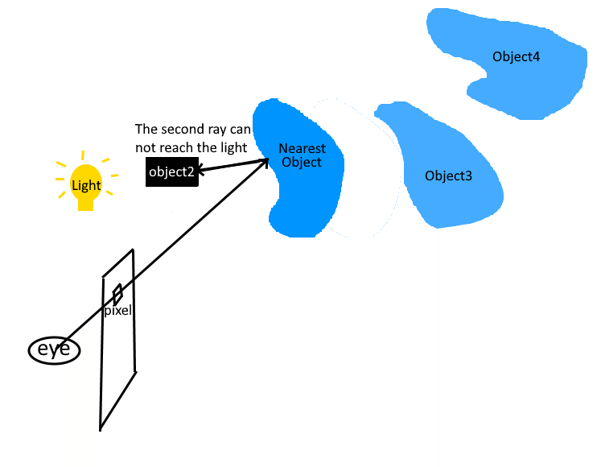
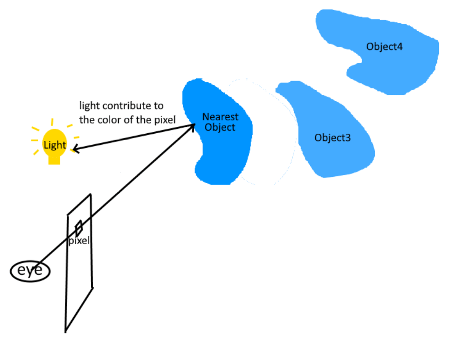
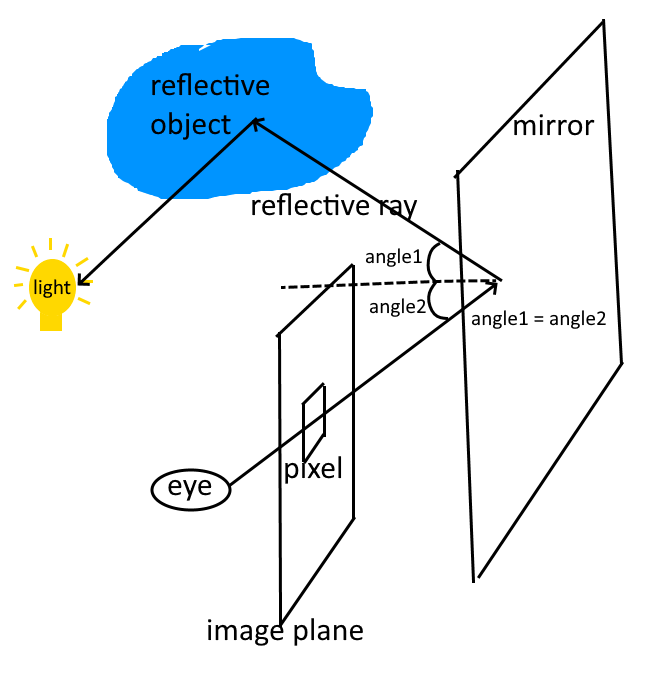

# Ray Tracing (Yen-Yun Wu & Niya Shao)

## Introduction
Ray Tracing is an image rendering technique that provides photorealism. In comparison to Rasterization, it also renders higher quality of effects such as shadows, reflections, transparency, inter-reflections, and realistic materials.

----

## Underlying Secrets

Mechanism of **seeing** an object: When the light hits an object, it will scattered and reflected to different directions. If any of the scattered or reflected light rays reaches a receiver, aka a camera or an eye, the receiver will **see** the object.

### Representing object as triangles TODO

Ray tracer leverages this physics rule to render an image based on a 3D scene. It simulates a light path from the eye to an pixel in the image plane.

### Ray Through Pixel TODO
including equation

Extending this light path, it might **hit** multiple objects in the scene.

### Intersection TODO
- lamda, t, q, n

Among those hits, the **nearest** hit is the one which might scatter light from light source.

The objected been hit can have different material properties:
### TODO
- diffuse: in ideal diffuse, light is 
- recursive specular

### Shadow

Upon this point, the ray tracer knows which object the pixel might seen. However, this nearest object could be in shadow casted by other objects. Therefore, the second ray is shoot from the location of the hit to all the light sources. If the second ray hits an object, aka an object impeding the light from the light source, then the nearest object is in shadow. Thus, this light source will not be taken account into the pixel's color.

On the opposite, if the second ray successfully reaches the light, then the properties of materials and lights can be used to calculate the pixel's color.

### Mirror Reflection

Beside direct light sources, the light indirectly reflected from other objects could also reach the nearest object, which is then reflected again and reach the pixel and the eye.

Imagine a mirror is stand in front of the eye and the image plane. The light from mirror could be from other object in the scene. This is how the viewer observe other objects from a mirror's surface. This mirror-like behavior of material is recorded as **specular** properties.

Therefore, besides the second ray to light source, another ray called **reflective ray** is shoot from the hit location such that it follows the reflective angle with respect to the surface normal. The color seen by this reflective ray is regarded as a light source used for the specular properties of the material.

---

## Implementation
Before the actual implementation of Ray Tracing, it is required to create serveral classes:
- `Image`: Contains the arrays of pixels where the color computed by ray tracer is stored. Also contains a frame buffer object and a texture buffer object which are used to draw the image on the screen using `Image::draw()` provided in the writeup. Its width and height is customizable.
- `Triangle`: Contains 3 point coordinates, 3 normal vectors, and a pointer to material.
- `RTGeometry`: Contains a list of triangles with their coordinates under the model coordinate system.
- `RTObj` and `RTCube`: Instead of filling in the vertex/index buffer data, the `init()` function of each model will fill in the list of triangles.
- `RTScene`:  Instead of drawing a model during DFS, it builds a triangle soup consisting of all triangles from all models within the scene. Specifically, it traverses over the scene graph, applies the proper model matrix and view matrix to transform the triangles to the camera coordinate system, and assigns the proper material for each triangle.
- `Ray`: Contains the base point and the direction of a ray.
- `Intersection`: Contains the position of an intersection, the surface normal, the direction to the incoming ray, the pointer to the geometric primitive (and matetial information), and the distance to the source of ray.

And also several helper functions:
- `RayThruPixel`: Calculates a ray under the camera coordinate system given the camera, a position (i, j), and the width/height of the image. (According to p.25-26 of RayTracing lecture slides)
- `Intersect` on Triangle: Returns an intersection object given an incoming ray and an intersecting triangle. At a high level, it finds the barycentric coordinate ($\lambda$) to interpolate the position of intersection and corresponding surface normal, and computes the distance between the ray source and the intersection. An intersection exsits if and only if the $\lambda$ and the distance are greater or equal to zero. Otherwise, the returned intersection object will have a distance of infinity (defined as $2^{10}$ in this project).
- `Intersect` on Scene: Returns an intersection object given an incoming ray and the scene. Specifically, it traverses the triangle soup of the scene and finds the closest intersection to the ray. Similar as the `Intersect` on triangle, it returns an intersection object with its distance infinity representing the given ray does not hit anything in the scene. 
- `FindColor`: Returns the computed color of the given intersection. The code applies the algorithm provided in Ray Tracing lecture slides p.71. It leverages both recursive shading model and mirror reflection. If recursion depth is 0, the color will be computed using the old-school diffuse model. Otherwise, it will compute either the recusive specular or diffuse shading.

Finally, `RayTrace` function is implemented. At a high level, for each pixel in the image, it samples multiple times to compute the ray through that pixel, the intersection of that ray, and the corresponding color seen given that intersection. Then, the final color is the average of those sample colors. Since the rendering of the texture buffer begins from the bottom left, resulting in an upside down image, we recomputes a correct coordinate to get a image in a proper direction.

In `main.cpp`, `display` function is changed such that it initializes the scene, computes the triangle soup, performs ray tracing, and render the image. 

Note: Our implementation does not accommodate the use of keyboard for real-time rendering. Please refer to the first rendered image in the window as the final result of the ray tracing.

# Recursive diffuse not good. Old school diffuse works for now.

## Demonstration of Results

## Reference
1. Ray Tracing Writeup
2. Piazza
3. Ray Tracing Lecture slides

5%: Write-up (PDF file) (or a link to accessible google doc, github webpage, etc): Introduce the topic, briefly explain the math/physics underpinning the method, describe the algorithm. Show your understanding of the topic by explaining the subject to the reader.

5%: Implementation (source code)

10%: Demonstration: A compilation of your favorite results that best show the significant points of the topic. This demonstration can be of a form of a video clip. If the work is very static, then you can just put a result section in your write-up as the demonstration. We encourage a video since a video is useful for showing your user interface design for your program, and definitely useful for showing an animated result.

5%: Bonus for excellent final projects.